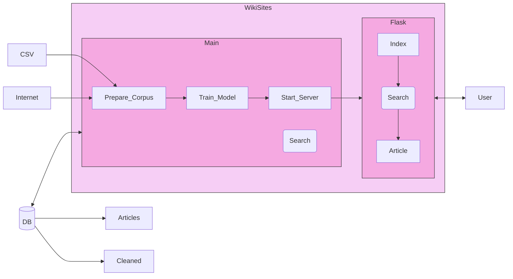
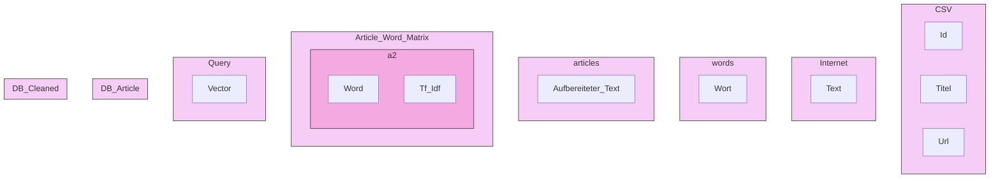

```mermaid
flowchart LR
subgraph WikiSites
    direction LR
    style WikiSites fill:#F6CEF5,stroke:#333
    style Main fill:#F5A9E1,stroke:#333
    style Flask fill:#F5A9E1,stroke:#333
    subgraph Main
        Prepare_Corpus --> Train_Model --> Start_Server
        s2(Search)
    end
    subgraph Flask
        s1(Search)
        Index --> s1
        s1 --> Article
    end
    Start_Server --> Flask
end
CSV --> Prepare_Corpus
id[(DB)] <--> Main
id --> Articles
id --> Cleaned
Internet --> Prepare_Corpus
Flask <--> User
```

```mermaid
flowchart TB

style CSV fill:#F6CEF5,stroke:#333
style Internet fill:#F6CEF5,stroke:#333
style words fill:#F6CEF5,stroke:#333
style articles fill:#F6CEF5,stroke:#333
style Article_Word_Matrix fill:#F6CEF5,stroke:#333
style Query fill:#F6CEF5,stroke:#333
style DB_Article fill:#F6CEF5,stroke:#333
style DB_Cleaned fill:#F6CEF5,stroke:#333

style a2 fill:#F5A9E1,stroke:#333


subgraph CSV
    Id
    Titel
    Url
end

subgraph Internet
    Url
    Titel
    Text
end

subgraph words
    Wort
end

subgraph articles
    Id
    Titel
    Url
    Text
    Aufbereiteter_Text
end

subgraph Article_Word_Matrix
    a2(Article)
    subgraph a2
        Word
        Tf_Idf
    end
end

subgraph Query
    Text
    Vector
end

subgraph DB_Article
    Id
    Titel
    Url
    Text
end

subgraph DB_Cleaned
    Id
    Aufbereiteter_Text
end
```